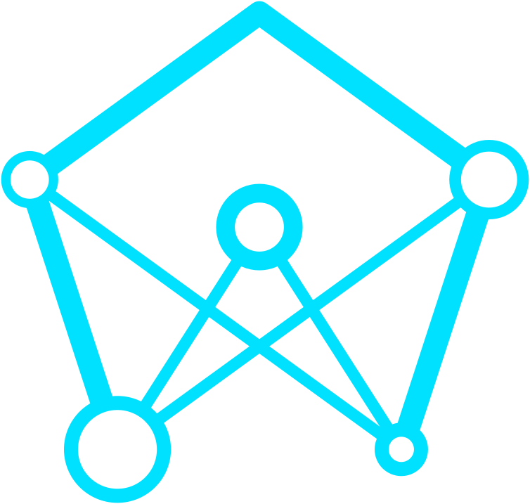

LIGHTNET
========
  
Building blocks to recreate Darknet networks in Pytorch  

## Why another framework
[pytorch-yolo2](https://github.com/marvis/pytorch-yolo2) is working perfectly fine, but does not easily allow a user to modify an existing network.
This is why I decided to create a library, that gives the user all the necessary building blocks, to recreate any darknet network.  
This library has everything you need to control your network, weight loading & saving, datasets, dataloaders and data augmentation.

## Installing
First install [PyTorch and Torchvision](http://pytorch.org/).  
Then clone this repository and run one of the following commands:
```bash
# If you just want to use Lightnet
pip install -r requirements.txt

# If you want to develop Lightnet
pip install -r develop.txt
```
> This project is python 3.6 and higher so on some systems you might want to use 'pip3.6' instead of 'pip'

## How to use
[Click Here](https://eavise.gitlab.io/lightnet) for the API documentation and guides on how to use this library.  
The _examples_ folder contains code snippets to train and test networks with lightnet. For examples on how to implement your own networks, you can take a look at the files in _lightnet/models_.
>If you are using a different version than the latest,
>you can generate the documentation yourself by running `make clean html` in the _docs_ folder.
>This does require some dependencies, like Sphinx.
>The easiest way to install them is by using the __-r develop.txt__ option when installing lightnet.

## Credits
Credits where credits are due.  
This library would not have been possible without the great work of the following people:
  - [pjreddie et al.](https://github.com/pjreddie/darknet) for their work on the original YOLO networks
  - [marvis](https://github.com/marvis/pytorch-yolo2) for his implementation of YOLO in pytorch. I took a lot of parts from this repository, and tweaked them to my needs.
  - [longcw](https://github.com/longcw/yolo2-pytorch) for his implementation of YOLO in pytorch. I used his code to get a correct region loss.
  - [The PyTorch team](http://pytorch.org) for creating a clear and powerfull library for deep learning.
  - [Andrew G. Howard et al](https://goo.gl/jM15AT) for their work on efficient MobileNets.
