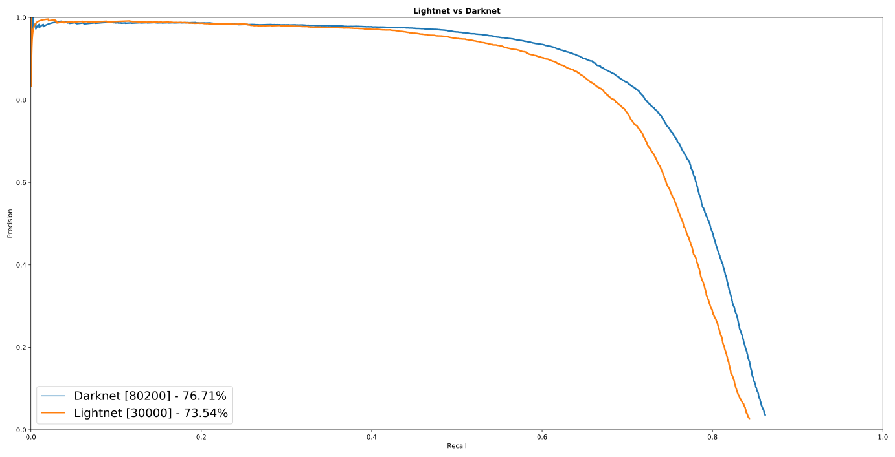

Comparing scores
================
In this document we will compare the average precision of networks, running in this library and in darknet_.

Yolo-VOC
--------

.. Todo::
   - Rework text to point to documentation guide
   - Get new training results and graph

We compared the Yolo network on the Pascal VOC imageset.
For more information on how to recreate these results, take a look at *examples/yolo-voc* in the lightnet_ repo.
We followed the training schedule explained in this `darknet config`_ file, which only trains for 45000 batches.
Training for 80200 batches takes quite a long time, I might try this some time later if I have nothing else to train. |br|
`darknet weight file`_ - `lightnet weight file`_

=========  =======  ======= ===============================
Framework  Batches  mAP (%) Note
=========  =======  ======= ===============================
Darknet    80200    76.8    According to paper, untested
---------  -------  ------- -------------------------------
Lightnet   80200    76.7    Pretrained weights from darknet
---------  -------  ------- -------------------------------
Lightnet   30000    73.5    Trained and tested in lightnet
=========  =======  ======= ===============================

.. include:: ../links.rst
.. _darknet config: https://github.com/pjreddie/darknet/blob/777b0982322142991e1861161e68e1a01063d76f/cfg/yolo-voc.2.0.cfg
.. _darknet weight file: https://pjreddie.com/media/files/yolo-voc.weights
.. _lightnet weight file: htpps://gitlab.com/EAVISE/lightnet/tree/master/examples/yolo-voc/lightnet_weights.pt
