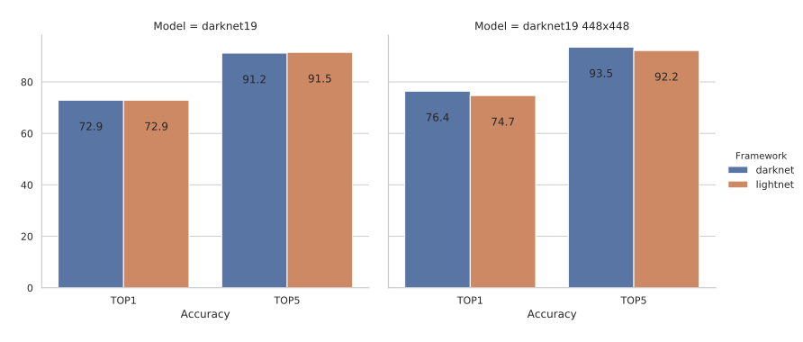
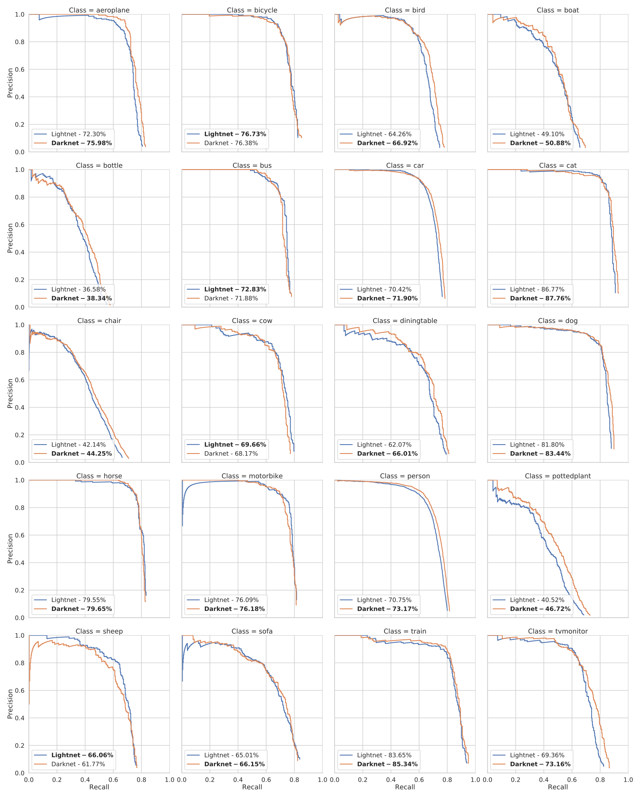

.. _accuracy:

Comparing to darknet
====================
In this document we will compare the accuracy of networks running in this library and in darknet_.

ImageNet
--------
We went through the hassle of training darknet19 on ImageNet from scratch, to be able to compare the results with the darknet framework.
As you can see, lightnet achieves about the same results as darknet for this task. |br|

Pascal VOC
----------

.. Todo::
   - Change weight files
   - Change voc_results.svg

We compared the Yolo V2 network on the Pascal VOC imageset.
For more information on how to recreate these results, take a look at the :ref:`Pascal VOC <pascalvoc>` page.
*(Note that we ignore difficult annotations for these evaluations)*

========= ======= ================= ===============================================
Framework mAP (%) Weight File       Note
========= ======= ================= ===============================================
Darknet   77.2    `weights <dnw_>`_ Darknet weights with Lightnet evaluation code
--------- ------- ----------------- -----------------------------------------------
Lightnet  75.6    `weights <lnw_>`_ Transfer learned from Lightnet ImageNet weights
========= ======= ================= ===============================================

.. include:: ../links.rst
.. _darknet config: https://github.com/pjreddie/darknet/blob/777b0982322142991e1861161e68e1a01063d76f/cfg/yolo-voc.2.0.cfg
.. _dnw: https://pjreddie.com/media/files/yolov2-voc.weights
.. _lnw: https://mega.nz/#!KhdGmYzK!XUW4sJcZKmoFJP7hKrZj-9vhlPg7NBDvmpw0fjaEs08
