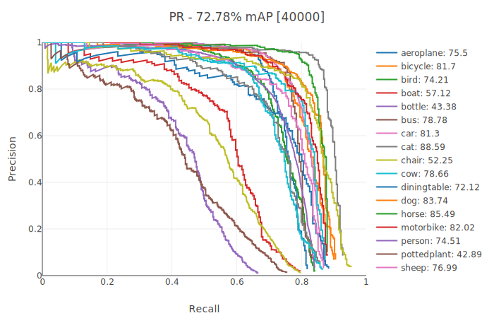

Comparing scores
================
In this document we will compare the average precision of the Yolo network, running on this library and on `darknet`_.

Yolo-VOC test
-------------
We compared training and testing the Yolo network on the Pascal VOC imageset. For more information on how to recreate these results, take a look at *examples/YoloVOC* in the `lightnet`_ repo. |br|
`darknet weight file`_ - `lightnet weight file`_

========  =======  =======
Network   Batches  mAP (%)
========  =======  =======
Lightnet  40000    73.3
--------  -------  -------
Darknet   80200    76.8
========  =======  =======

.. include:: ../links.rst
.. _darknet weight file: https://pjreddie.com/media/files/yolo-voc.weights
.. _lightnet weight file: htpps://gitlab.com/EAVISE/lightnet/tree/master/examples/YoloVOC/final_weights.pt
